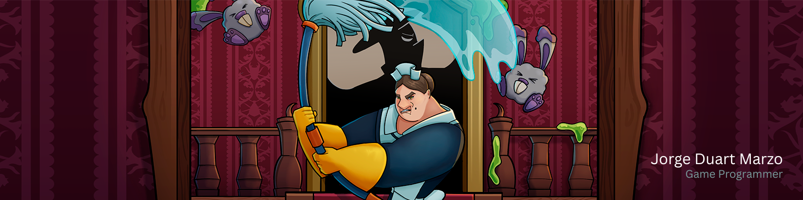

# 
 👋 Hi! My name is Jorge Duart  

### 
 Game Programmer and Software Engineer with a deep passion for game development.

---
# 💫 About Me:
Specialising in UE5 and C++, I have also taken part in some projects with Unity.
I'm interested in and have been involved in:
- Gameplay programming (combat, environment interaction, etc.)
- AI programming (behaviour trees, token system, etc.) 
- Other systems (persistent saving, replayability, etc.)

I am always looking to learn more and improve myself, as well as writing clean, legible, scalable, and secure code.

---
# 💻 Tech Stack:
  

     

    

   

---
# 🌐 Socials:
 
 
